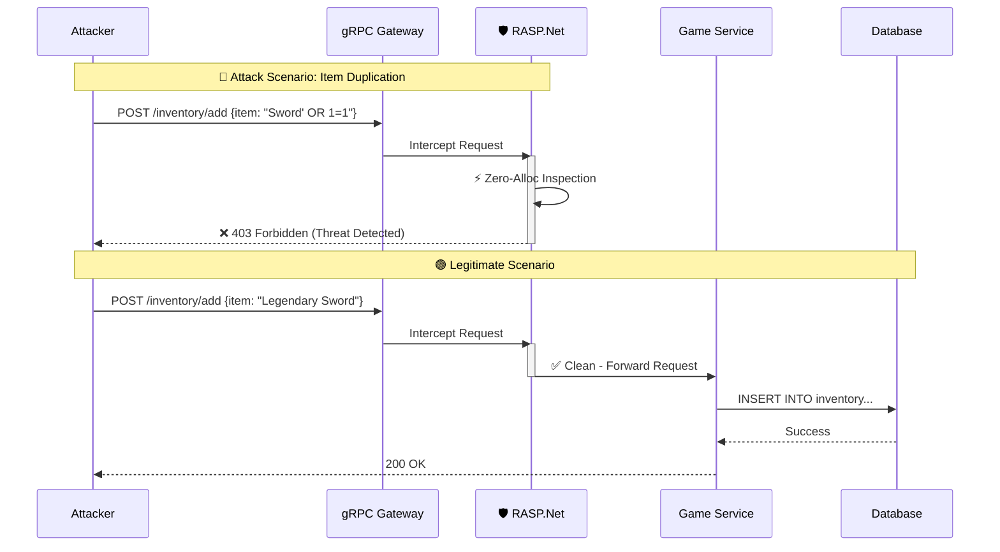

# 🛡️ RASP.Net


[](docs/ATTACK_SCENARIOS.md)

> **Runtime Application Self-Protection (RASP) for High-Scale .NET Services**
> *Defense that lives inside your application process, operating at the speed of code.*

---

## 🎮 Why This Matters for Gaming Security

**The Problem**: Multiplayer game services process **millions of transactions per second**. Traditional WAFs introduce network latency and cannot see inside the encrypted gRPC payload or understanding game logic context.

**The Solution**: RASP.Net acts as a **last line of defense** inside the game server process. It instruments the runtime to detect attacks that bypass perimeter defenses, detecting logic flaws like item duplication exploits or economy manipulation.

**Key Engineering Goals:**
1.  **Zero GC Pressure**: Security checks must NOT trigger Garbage Collection pauses that cause frame drops/lag.
2.  **Sub-Microsecond Latency**: Checks happen in nanoseconds, not milliseconds.
3.  **Defense in Depth**: Complements kernel-level Anti-Cheat (BattlEye/EAC) by protecting the backend API layer.

---

## ⚡ Performance Benchmarks

**Methodology:** Benchmarks isolate the intrinsic cost of the detection engine using `BenchmarkDotNet`.
**Hardware:** AMD Ryzen 7 7800X3D (4.2GHz) | **Runtime:** .NET 10.0.2

| Payload Size | Scenario | Mean Latency | Overhead vs Baseline | **GC Allocation** |
| :--- | :--- | :--- | :--- | :--- |
| **100 Bytes** | Safe Scan | **12.1 ns** | +11.5 ns | **0 Bytes** |
| | Attack Blocked | **18.4 ns** | +17.8 ns | **0 Bytes** |
| **1 KB** | Safe Scan | **22.2 ns** | +21.6 ns | **0 Bytes** |
| | Attack Blocked | **31.1 ns** | +30.5 ns | **0 Bytes** |
| **10 KB** | Safe Scan | **137.4 ns** | +136.8 ns | **0 Bytes** |
| | Attack Blocked | **156.7 ns** | +156.1 ns | **0 Bytes** |

> **Analysis:** The engine demonstrates **sub-linear scaling** thanks to .NET 10's vectorized optimizations (AVX/SIMD). Inspecting 10KB of data takes only ~0.15μs. Most importantly, **Zero Allocation** is maintained across all scenarios, ensuring **no impact on game server frame budgets**.

---

## 🛡️ Security Analysis & Threat Modeling

For a comprehensive analysis of attack vectors, STRIDE mapping, and Red Team validation, see:

📄 **[THREAT_MODEL.md](docs/ATTACK_SCENARIOS.md)** - Complete threat analysis including:
- Economy manipulation exploits (SQL injection via gRPC)
- Runtime tampering detection (anti-cheat)
- DoS mitigation strategies (GC pressure attacks)
- Exploitation walkthroughs with Python PoCs

**Key Highlights**:
- ✅ STRIDE analysis matrix with implementation status
- ✅ Real-world attack scenarios from gaming industry
- ✅ Red Team validation with bypass attempts

---

## 🏗️ Architecture: Composite Solution

This repository utilizes a **Composite Architecture Strategy**.  
It is designed to develop and validate the Security SDK (`Rasp.*`) by instrumenting a real-world "Victim" application (`dotnet-grpc-library-api`) without polluting its source code.

### 📂 Structure

| Directory | Component | Description |
|:----------|:----------|:------------|
| **`src/`** | 🛡️ **The Defense (SDK)** | The RASP Source Code. |
| `├── Rasp.Core` | 🧠 *Kernel* | Detection engine & telemetry contracts |
| `├── Rasp.Instrumentation.Grpc` | 📡 *Sensor* | gRPC request interceptors |
| `├── Rasp.Bootstrapper` | ⚙️ *Loader* | DI extensions (`AddRasp()`) |
| **`modules/`** | 🎯 **The Victim (Target)** | Git submodules |
| `└── dotnet-grpc-library-api` | 🏛️ *App* | Clean Architecture sample |

---

## 🛡️ How It Works (Attack Flow)


---

## 🚀 Setup & Build

⚠️ **CRITICAL:** This repository relies on submodules. A standard clone will result in missing projects.

### 1. Clone Correctly

Use the `--recursive` flag to fetch the Target Application code:
```bash
git clone --recursive https://github.com/JVBotelho/RASP.Net.git
```

If you have already cloned without the flag:
```bash
git submodule update --init --recursive
```

### 2. Build the Composite Solution

We use a "God Mode" solution file (`Rasp_Dev.sln`) that links both the SDK and the Victim App for a unified debugging experience.
```bash
dotnet build Rasp_Dev.sln
```

---

## 🔧 Troubleshooting

**Problem**: `Submodule 'modules/dotnet-grpc-library-api' not found`  
**Solution**: Run `git submodule update --init --recursive`

**Problem**: `The type or namespace name 'Rasp' could not be found`  
**Solution**: Ensure you're opening `Rasp_Dev.sln`, not individual `.csproj` files

**Problem**: gRPC service not starting  
**Solution**: Check if port 5001 is already in use: `netstat -ano | findstr :5001`

---

## 🧪 Development Workflow

The Composite Solution allows you to debug the SDK as if it were part of the application, while keeping git histories separate.

1. Open `Rasp_Dev.sln` in Rider or Visual Studio.
2. **Set Startup Project**: Select `LibrarySystem.Api` (from the `modules` folder).
3. **Debug**: Breakpoints in `Rasp.Instrumentation.Grpc` will be hit when requests are sent to the API.

---

## 🛑 Rules of Engagement

- **Modify `src/`**: Commits go to this repository (`RASP.Net`).
- **Modify `modules/`**: Commits go to the `dotnet-grpc-library-api` repository. Do not modify the victim code unless necessary for integration hooks.

---

## 🛡️ Security & Performance Goals

- **Zero-Allocation Hot Paths**: Usage of `Span<T>` and frozen collections to minimize GC pressure during inspection.
- **Observability First**: Native OpenTelemetry integration (`System.Diagnostics.ActivitySource`).
- **Safe by Design**: Strict mode enabled (`<TreatWarningsAsErrors>true`).

---

## 🎯 Roadmap

- [x] **Phase 1**: Setup & Vulnerability injection in Target App
- [x] **Phase 2**: gRPC Interceptor with payload inspection
- [ ] **Phase 3**: EF Core Interceptor with SQL analysis 🚧 **IN PROGRESS**
- [ ] **Phase 4**: Benchmarks & Documentation

---

## 🤝 Contributing

This is an educational/research project for **Advanced AppSec Training**.  
Contributions are welcome via pull requests. Please ensure:

- All tests pass (`dotnet test`)
- Code follows .NET conventions (`dotnet format`)
- Security improvements are documented

---

## 📖 References

- [OWASP RASP](https://owasp.org/www-community/controls/Runtime_Application_Self_Protection)
- [gRPC Interceptors in .NET](https://learn.microsoft.com/en-us/aspnet/core/grpc/interceptors)
- [EF Core Interceptors](https://learn.microsoft.com/en-us/ef/core/logging-events-diagnostics/interceptors)

---

## 📜 License

**MIT License** - Free and open source.
```
Copyright (c) 2025 RASP.Net Contributors

Permission is hereby granted, free of charge, to any person obtaining a copy
of this software and associated documentation files (the "Software"), to deal
in the Software without restriction, including without limitation the rights
to use, copy, modify, merge, publish, distribute, sublicense, and/or sell
copies of the Software.
```

**TL;DR:**
- ✅ Use commercially, modify, distribute, private use
- ✅ No restrictions on derivative works
- ⚠️ Provided "as is" without warranty
- 📋 Must include license notice in copies

See [LICENSE](LICENSE) for full terms.

---

Found a security issue? See [SECURITY.md](SECURITY.md) for responsible disclosure.

---

**⚡ Built with .NET 10 Preview | Powered by Clean Architecture**