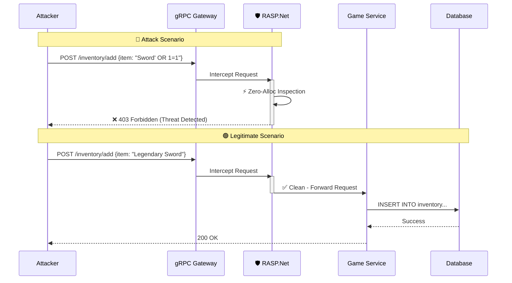

# 🛡️ RASP.Net


[](https://www.nuget.org/packages/Rasp.Net)
[](docs/ATTACK_SCENARIOS.md)
[](docs/REVERSE_ENGINEERING.md)

> **Runtime Application Self-Protection (RASP) for High-Scale .NET Services**  
> *Defense that lives inside your application process, operating at the speed of code.*

> [!IMPORTANT]
> **🚧 ARCHITECTURAL PREVIEW / ALPHA STAGE**
>
> This project is currently in **Active Research & Development**. 
> * **Do not deploy to production** environments handling real assets (PII, Financial Data) without a full security audit.
> * **API Stability:** Public interfaces and interception signatures may undergo **breaking changes** to optimize for zero-allocation performance.
> * **Security:** While designed to block attacks, this engine is currently being tuned for false positives/negatives.

---

## 📦 Installation

Packages are published to NuGet.org under lockstep SemVer (see [RELEASING.md](RELEASING.md)).
Install the meta-package for the default experience — **Phase A only**, no runtime patching pulled
in transitively:

```bash
dotnet add package Rasp.Net
```

Then wire it up:

```csharp
builder.Services.AddRasp();
```

Individual guards are also available standalone (useful if you only need one, e.g. for trimming):
`Rasp.Net.Core`, `Rasp.Net.AspNetCore`, `Rasp.Net.Grpc`, `Rasp.Net.EntityFrameworkCore`,
`Rasp.Net.AdoNet`, `Rasp.Net.HttpClient`, `Rasp.Net.SystemTextJson`.

`Rasp.Net.RuntimePatching` (MonoMod-based guards) is **opt-in only** — it is never a transitive
dependency of `Rasp.Net` — and carries its own AOT-incompatibility and AV/EDR-flagging warnings.
See [ADR 008](docs/ADR/008-nuget-packaging.md) for the full package map and risk boundary.

---

## 🎮 Why This Matters for Gaming Security

**The Problem**: Multiplayer game services process **millions of transactions per second**. Traditional WAFs introduce network latency and cannot see inside encrypted gRPC payloads or understand game logic context.

**The Solution**: RASP.Net acts as a **last line of defense** inside the game server process. It instruments the runtime to detect attacks that bypass perimeter defenses—detecting logic flaws like item duplication exploits or economy manipulation.

**Key Engineering Goals:**
1. **Zero GC Pressure**: Security checks must NOT trigger Garbage Collection pauses that cause frame drops/lag
2. **Sub-Microsecond Latency**: Checks happen in nanoseconds, not milliseconds
3. **Defense in Depth**: Complements kernel-level Anti-Cheat (BattlEye/EAC) by protecting the backend API layer

---

## ⚡ Performance Benchmarks

### Perimeter scan: Source Generator vs. Reflection

**Methodology:** `BenchmarkDotNet` comparing Source Generator (compile-time) vs Reflection (runtime) instrumentation.  
**Hardware:** AMD Ryzen 7 7800X3D | **Runtime:** .NET 10.0.2 (RyuJIT AVX-512)

| Method | Scenario | Mean | Allocated | Speedup |
|:-------|:---------|-----:|----------:|:-------:|
| **Source Generator** | ✅ Clean Scan | **108.9 ns** | 136 B | **10.3x faster** 🚀 |
| Reflection | ✅ Clean Scan | 1,120.0 ns | 136 B | *baseline* |
| **Source Generator** | 🛡️ Attack Blocked | **4,090 ns** | 1,912 B | **1.04x faster** |
| Reflection | 🛡️ Attack Blocked | 4,260 ns | 1,552 B | *baseline* |

> **Key Insights:**
> * **10x Faster Hot Path:** Source-generated interceptors eliminate runtime reflection overhead, critical for high-throughput game servers
> * **Sub-Microsecond Latency:** Clean traffic passes through in **~109 nanoseconds**—invisible
> * **SIMD Optimization:** Uses `SearchValues<T>` for vectorized character scanning before deep inspection

### Sink overhead under sustained load (RASP on vs. off)

**Methodology:** real Kestrel host, real backends (Postgres via Testcontainers, real subprocess, real
outbound HTTP), 25 concurrent workers sustained for 20s per endpoint. Not a synthetic `Inspect()`
call in isolation — these are p50/p99 request latencies with the entire sink wired in or fully
absent. Full methodology and per-guard micro-benchmarks in [ADR 006](docs/ADR/006-sink-instrumentation-strategy.md#measured-end-to-end-latency-under-sustained-load-2026-07-02).

| Sink | RASP off (p50 / p99) | RASP on (p50 / p99) | Verdict |
|:-----|----------------------:|----------------------:|:--------|
| Path Traversal (`FileStream`) | 851 µs / 1349 µs | 858 µs / 1404 µs | indistinguishable from noise |
| Command Injection (`Process.Start`) | 60.76 ms / 108.22 ms | 61.50 ms / 104.59 ms | indistinguishable from noise |
| SQL (EF Core → Postgres) | 7.76 ms / 16.97 ms | 7.50 ms / 16.50 ms | indistinguishable from noise |
| SSRF (`HttpClient`) | 299 µs / 756 µs | 306 µs / 914 µs | indistinguishable from noise |

> **Key Insight:** RASP's own cost never surfaces above the real I/O it's guarding — a file open, a
> process spawn, a database round trip, or an outbound HTTP call already costs orders of magnitude
> more than the guard's inspection. SSRF's guard has a real DNS-rebinding check
> (`SocketsHttpHandler.ConnectCallback`), but connection pooling means it fires roughly once per
> pooled connection, not once per request — see
> [ADR 006](docs/ADR/006-sink-instrumentation-strategy.md#ssrf-dns-cache-raspoptionsssrfdnscacheduration--investigation-and-honest-result)
> for why that makes an opt-in DNS cache redundant in exactly the traffic pattern where it's safe
> to use.

---

## 🛡️ Security Analysis & Threat Modeling

Professional-grade security documentation demonstrating **Purple Team** capabilities.

| Document | Description |
|:---------|:------------|
| 📄 [Threat Model & Attack Scenarios](docs/ATTACK_SCENARIOS.md) | STRIDE analysis: gRPC SQL Injection, Protobuf Tampering, GC Pressure DoS |
| 🕵️ [Reverse Engineering & Anti-Tamper](docs/REVERSE_ENGINEERING.md) | Native C++ protection: `IsDebuggerPresent`, PEB manipulation, timing checks |
| 📦 [Release Process & SemVer Policy](RELEASING.md) | The release pipeline and semantic versioning policy for security updates |

---

## 🏗️ Architecture

This repository uses a **Composite Architecture Strategy**—developing and validating the Security SDK by instrumenting a real-world "Victim" application without polluting its source code.

```
RASP.Net/
├── src/                           # 🛡️ RASP SDK (Defense)
│   ├── Rasp.Core/                 # Detection engines & telemetry
│   ├── Rasp.SourceGenerators/     # Roslyn code generation
│   ├── Rasp.Instrumentation.Grpc/ # gRPC interceptors
│   └── Rasp.Bootstrapper/         # DI extensions (AddRasp())
├── modules/                       # 🎯 Victim App (Target)
│   └── dotnet-grpc-library-api/   # Git submodule - Clean Architecture sample
├── attack/                        # ⚔️ Red Team Tools
│   ├── exploit_xss.py             # XSS attack suite
│   └── exploit_grpc.py            # SQLi attack suite
└── scripts/                       # Automation scripts
```

---

## 🛡️ How It Works


```mermaid
sequenceDiagram
    participant Attacker
    participant gRPC as gRPC Gateway
    participant RASP as 🛡️ RASP.Net
    participant GameAPI as Game Service
    participant DB as Database
    
    Note over Attacker,RASP: 🔴 Attack Scenario
    Attacker->>gRPC: POST /inventory/add {item: "Sword' OR 1=1"}
    gRPC->>RASP: Intercept Request
    activate RASP
    RASP->>RASP: ⚡ Zero-Alloc Inspection
    RASP-->>Attacker: ❌ 403 Forbidden (Threat Detected)
    deactivate RASP
    
    Note over Attacker,DB: 🟢 Legitimate Scenario
    Attacker->>gRPC: POST /inventory/add {item: "Legendary Sword"}
    gRPC->>RASP: Intercept Request
    activate RASP
    RASP->>GameAPI: ✅ Clean - Forward Request
    deactivate RASP
    GameAPI->>DB: INSERT INTO inventory...
    DB-->>GameAPI: Success
    GameAPI-->>Attacker: 200 OK
```

---

## 🚀 Quick Start (Development)

The composite/submodule setup below is the **development** workflow — for consuming the SDK in
your own project, use the [Installation](#-installation) section above instead.

### 1. Clone with Submodules

```bash
git clone --recursive https://github.com/JVBotelho/RASP.Net.git
cd RASP.Net

# If already cloned without --recursive:
git submodule update --init --recursive
```

### 2. Build & Run

```bash
# Option A: Use automated setup script
./scripts/pack-local.ps1   # Windows
./scripts/pack-local.sh    # Linux/macOS

# Option B: Build directly
dotnet build Rasp.sln
```

### 3. Run the Victim App

```bash
cd modules/dotnet-grpc-library-api
dotnet run --project LibrarySystem.Grpc
```

---

## ⚔️ Security Testing (Red Team)

### Prerequisites

```bash
pip install grpcio grpcio-tools
```

### Generate Attack Protos

```powershell
# Windows
python -m grpc_tools.protoc `
  -I ./modules/dotnet-grpc-library-api/LibrarySystem.Contracts/Protos `
  --python_out=./attack --grpc_python_out=./attack `
  ./modules/dotnet-grpc-library-api/LibrarySystem.Contracts/Protos/library.proto
```

```bash
# Linux/macOS
python3 -m grpc_tools.protoc \
  -I ./modules/dotnet-grpc-library-api/LibrarySystem.Contracts/Protos \
  --python_out=./attack --grpc_python_out=./attack \
  ./modules/dotnet-grpc-library-api/LibrarySystem.Contracts/Protos/library.proto
```

### Run Exploit Suites

```bash
# Target app must be running on localhost:5049
python attack/exploit_xss.py localhost:5049
python attack/exploit_grpc.py localhost:5049
```

**Expected Output:**
```
📊 XSS Security Report
========================================
Attacks Blocked:  ✅ 7
Bypasses Found:   ❌ 0
False Positives:  ✅ 0
```

---

## 🔧 Troubleshooting

| Problem | Solution |
|:--------|:---------|
| `Submodule not found` | Run `git submodule update --init --recursive` |
| `Namespace 'Rasp' not found` | Open `Rasp.sln`, not individual `.csproj` files |
| `gRPC UNAVAILABLE` | Check target port matches (default: `localhost:5049`) |
| `Proto files not found` | Run `pip install --upgrade grpcio-tools` |

---

## 🎯 Roadmap

Sequenced for the project's goal: a production-grade OSS RASP for the .NET ecosystem, submitted
to OWASP (Incubator → Lab) and — once packages are published and community traction exists — to
the .NET Foundation. Adoption infrastructure (Stages 1–2) deliberately comes before new detection
features (Stage 3): a security product nobody can `dotnet add package` is a repository, not a product.

### ✅ Shipped — the foundation

- [x] Composite solution setup & vulnerability injection
- [x] gRPC Interceptor with XSS/SQLi detection
- [x] Source Generator for zero-config integration
- [x] EF Core Interceptor with SQL analysis
- [x] Native anti-tamper layer ([ADR 003](docs/ADR/003-native-integrity-guard.md) — Windows shipped, Linux planned)
- [x] Sink-centric pivot: SQL / SSRF / Path Traversal / Command Injection / Deserialization guards ([ADR 006](docs/ADR/006-sink-instrumentation-strategy.md) Phases A & B)
- [x] CLR Profiler + taint tracking ([ADR 006](docs/ADR/006-sink-instrumentation-strategy.md) Phase C — v1 scope: `String.Concat(string, string)` propagation)
- [x] Ambient execution context: correlated source → sink alerts ([ADR 007](docs/ADR/007-execution-context.md))

### ✅ Stage 1 — Ship it as a product (NuGet) — shipped 2026-07-06

- [x] **NuGet packages** for the managed SDK. The cross-platform, supported-API core
      (ADR 006 Phase A guards + the ADR 007 context layer) is the installable product;
      MonoMod runtime patching (Phase B) stays opt-in; the CLR profiler (Phase C) ships
      separately as a Windows-only advanced preview. See [Installation](#-installation).
- [x] **Multi-target `net8.0;net10.0`** so both supported LTS lines can adopt.
- [x] **SemVer + release pipeline** ([ADR 009](docs/ADR/009-versioning-and-release-pipeline.md)) —
      tag-driven MinVer versioning, Central Package Management, Conventional Commits + generated
      changelog, and NuGet Trusted Publishing (no static API key). First release: `v1.2.0`.

### 🌐 Stage 2 — OWASP Incubator submission

Before submitting:

- [ ] Community baseline: `CODE_OF_CONDUCT.md`, issue templates, `GOVERNANCE.md` still open.
      [x] `good-first-issue` backlog seeded — [docs/good-first-issues.md](docs/good-first-issues.md)
      (native profiler taint-propagation targets) and
      [docs/good-first-issues-dotnet.md](docs/good-first-issues-dotnet.md) (.NET-only gaps).
- [ ] Isolate and clearly label the intentionally-vulnerable demo target (`modules/`) so its
      known-vulnerable packages are never mistaken for product dependencies.
- [x] **Recruit a second project leader** — current OWASP policy requires multiple leaders
      (not all from the same employer), so this gates the application itself.
      [@EderBorella](https://github.com/EderBorella) joined as collaborator and required
      reviewer on the `release` environment; bus factor is now 2.
- [ ] Start the [OSSF Best Practices](https://www.bestpractices.dev/) self-certification —
      a Lab-promotion criterion that is cheap to begin early.
- [ ] Draft the OWASP project-page content (`index.md`, description, roadmap) in advance —
      the `www-project-rasp-net` repo itself is provisioned by the OWASP Foundation under
      `github.com/OWASP` only **after** acceptance; having content ready means the page goes
      live immediately instead of sitting empty.
- [ ] Submit as an [OWASP Incubator project](https://owasp.org/projects/) — the MIT license,
      vendor neutrality, [threat model](docs/ATTACK_SCENARIOS.md) and [SECURITY.md](SECURITY.md)
      already meet the entry bar.

After acceptance:

- [ ] Transfer this repository to `github.com/OWASP` (GitHub preserves stars/issues/history and
      redirects old URLs), re-create Actions secrets, repoint badges and Codecov.
- [ ] Populate `www-project-rasp-net` with the drafted page content and keep it current —
      stale project pages are what gets OWASP projects flagged inactive.

### 🛡️ Stage 3 — [OWASP Top 10 (2025)](https://owasp.org/Top10/2025/) coverage (feature track)

The main feature track once the product is installable — closing the ⬜ rows below is what
drives Incubator → Lab progression.

A sink-based RASP is a natural fit for the injection/integrity/exception-handling families and a
poor fit for categories that are really about access-control policy, cryptography, or supply
chain — mapping kept honest rather than padded. Note the 2025 edition folded SSRF (CWE-918) into
**A01 Broken Access Control** rather than keeping it a standalone category, and added
**A10 Mishandling of Exceptional Conditions**, a much more precise fit for the deferred Lean
Sentinel work than the 2021 edition's A04/A09 had been:

| Category | Coverage | Mechanism |
|:---|:---|:---|
| **A01 Broken Access Control** (SSRF — CWE-918, Path Traversal) | ✅ Done | `SsrfGuard` (DNS-rebinding-safe `HttpClient` handler, [ADR 006](docs/ADR/006-sink-instrumentation-strategy.md)), `PathTraversalGuard` (MonoMod). The rest of A01 — IDOR, JWT/session handling, CORS — is access-control *policy*, not a sink a RASP can validate. |
| **A02 Security Misconfiguration** (headers) | ✅ Done | `RaspSecurityHeadersMiddleware` (CSP, etc.) |
| **A02 / A05 XXE** (`XmlReader` / `XmlDocument.Load`) | ⬜ Planned | policy guard disabling DTD/external entities (MonoMod) |
| **A05 Injection** (SQLi, XSS, Command Injection) | ✅ Done | `SqlSinkGuard`, source-generated XSS/SQLi scan, `CommandInjectionGuard` (MonoMod) |
| **A05 Injection** (LDAP Injection — `DirectorySearcher`) | ⬜ Planned | new `LdapInjectionDetectionEngine` (MonoMod) |
| **A08 Software or Data Integrity Failures** (insecure deserialization) | ✅ Done | `DeserializationGuard` + `System.Text.Json` type-info modifier |
| **A09 Security Logging & Alerting Failures** | ✅ Done | `RaspAlertBus`, correlated structured alerts ([ADR 007](docs/ADR/007-execution-context.md)), audit mode, metrics |
| **A10 Mishandling of Exceptional Conditions** (error messages/stack traces leaking system detail) | ⬜ Deferred | Lean Sentinel ([ADR 004](docs/ADR/004-memory-disclosure-protection.md) — accepted, implementation deferred) |
| A03 (Software Supply Chain), A04 (Cryptographic Failures), A06 (Insecure Design), A07 (Authentication Failures) | Out of scope | Dependency/CI-CD integrity, cryptography, architecture-level design review, and authentication are a different tooling category than a sink-based RASP; deliberately not attempted here. |

Second half of the Stage 3 track: the **AI/LLM boundary**
([ADR 011](docs/ADR/011-ai-llm-boundary.md)), covering the OWASP
[LLM Top 10 (2025)](https://genai.owasp.org/llm-top-10/) and
[Agentic Top 10 (2026)](https://genai.owasp.org/resource/owasp-top-10-for-agentic-applications-for-2026/)
where a sink-based RASP has ground truth. The position is deliberately narrow: treat the model
as an untrusted **source** (its output becomes tainted data, enforced by the existing sink
guards — LLM05/ASI05) and the agent tool call as an instrumentable **boundary** (function
allowlist, argument inspection, system-prompt canary — LLM06/LLM07/ASI02). No claim of
detecting prompt injection itself — that is probabilistic classification, kept behind an
opt-in, audit-mode seam. Ships as a separate package, `Rasp.Instrumentation.Ai`, so services
without LLM traffic never carry it.

### 🔭 Stage 4 — Depth, platform reach, foundation

- [ ] **Widen taint propagation** beyond `String.Concat(string, string)`: `string.Format`,
      interpolation lowering, `Substring`, `StringBuilder` — the gap [ADR 006](docs/ADR/006-sink-instrumentation-strategy.md)
      documents as v1's accepted limitation. Also extends how far LLM-output taint
      ([ADR 011](docs/ADR/011-ai-llm-boundary.md)) survives before reaching a sink.
- [ ] **Native test harness + Linux profiler port** — the IL rewriter currently has only a smoke
      test, and the profiler build is Windows-only (the non-Windows PAL scaffolding already exists
      in `profiler_pal.h`). Linux is where most ASP.NET Core production runs; this is what removes
      the "Windows-only advanced preview" label from Phase C.
- [ ] **Linux native integrity parity** (eBPF-based monitoring, [ADR 003](docs/ADR/003-native-integrity-guard.md)).
- [ ] **.NET Foundation application** — once packages are published, adoption signals exist, and
      the maintainer bus factor is above one. The Foundation works as a maturity seal, not a
      launch lever; applying before that is premature by its own admission criteria.

---

## 📚 References

- [OWASP RASP](https://owasp.org/www-community/controls/Runtime_Application_Self_Protection)
- [.NET Source Generators](https://learn.microsoft.com/en-us/dotnet/csharp/roslyn-sdk/source-generators-overview)
- [gRPC Interceptors](https://learn.microsoft.com/en-us/aspnet/core/grpc/interceptors)
- [SIMD in .NET](https://learn.microsoft.com/en-us/dotnet/standard/simd)

---

## 📜 License

**MIT License** - Free and open source. See [LICENSE](LICENSE) for full terms.

---

🔐 Found a security issue? See [SECURITY.md](SECURITY.md) for responsible disclosure.

**⚡ Built with .NET 10 | Powered by Clean Architecture**
