# 🛡️ RASP.Net


[](docs/ATTACK_SCENARIOS.md)
[](docs/REVERSE_ENGINEERING.md)

> **Runtime Application Self-Protection (RASP) for High-Scale .NET Services**  
> *Defense that lives inside your application process, operating at the speed of code.*

---

## 🎮 Why This Matters for Gaming Security

**The Problem**: Multiplayer game services process **millions of transactions per second**. Traditional WAFs introduce network latency and cannot see inside encrypted gRPC payloads or understand game logic context.

**The Solution**: RASP.Net acts as a **last line of defense** inside the game server process. It instruments the runtime to detect attacks that bypass perimeter defenses—detecting logic flaws like item duplication exploits or economy manipulation.

**Key Engineering Goals:**
1. **Zero GC Pressure**: Security checks must NOT trigger Garbage Collection pauses that cause frame drops/lag
2. **Sub-Microsecond Latency**: Checks happen in nanoseconds, not milliseconds
3. **Defense in Depth**: Complements kernel-level Anti-Cheat (BattlEye/EAC) by protecting the backend API layer

---

## ⚡ Performance Benchmarks

**Methodology:** `BenchmarkDotNet` comparing Source Generator (compile-time) vs Reflection (runtime) instrumentation.  
**Hardware:** AMD Ryzen 7 7800X3D | **Runtime:** .NET 10.0.2 (RyuJIT AVX-512)

| Method | Scenario | Mean | Allocated | Speedup |
|:-------|:---------|-----:|----------:|:-------:|
| **Source Generator** | ✅ Clean Scan | **108.9 ns** | 136 B | **10.3x faster** 🚀 |
| Reflection | ✅ Clean Scan | 1,120.0 ns | 136 B | *baseline* |
| **Source Generator** | 🛡️ Attack Blocked | **4,090 ns** | 1,912 B | **1.04x faster** |
| Reflection | 🛡️ Attack Blocked | 4,260 ns | 1,552 B | *baseline* |

> **Key Insights:**
> * **10x Faster Hot Path:** Source-generated interceptors eliminate runtime reflection overhead, critical for high-throughput game servers
> * **Sub-Microsecond Latency:** Clean traffic passes through in **~109 nanoseconds**—invisible
> * **SIMD Optimization:** Uses `SearchValues<T>` for vectorized character scanning before deep inspection

---

## 🛡️ Security Analysis & Threat Modeling

Professional-grade security documentation demonstrating **Purple Team** capabilities.

| Document | Description |
|:---------|:------------|
| 📄 [Threat Model & Attack Scenarios](docs/ATTACK_SCENARIOS.md) | STRIDE analysis: gRPC SQL Injection, Protobuf Tampering, GC Pressure DoS |
| 🕵️ [Reverse Engineering & Anti-Tamper](docs/REVERSE_ENGINEERING.md) | Native C++ protection: `IsDebuggerPresent`, PEB manipulation, timing checks |

---

## 🏗️ Architecture

This repository uses a **Composite Architecture Strategy**—developing and validating the Security SDK by instrumenting a real-world "Victim" application without polluting its source code.

```
RASP.Net/
├── src/                           # 🛡️ RASP SDK (Defense)
│   ├── Rasp.Core/                 # Detection engines & telemetry
│   ├── Rasp.SourceGenerators/     # Roslyn code generation
│   ├── Rasp.Instrumentation.Grpc/ # gRPC interceptors
│   └── Rasp.Bootstrapper/         # DI extensions (AddRasp())
├── modules/                       # 🎯 Victim App (Target)
│   └── dotnet-grpc-library-api/   # Git submodule - Clean Architecture sample
├── attack/                        # ⚔️ Red Team Tools
│   ├── exploit_xss.py             # XSS attack suite
│   └── exploit_grpc.py            # SQLi attack suite
└── scripts/                       # Automation scripts
```

---

## 🛡️ How It Works

```mermaid
sequenceDiagram
    participant Attacker
    participant gRPC as gRPC Gateway
    participant RASP as 🛡️ RASP.Net
    participant GameAPI as Game Service
    participant DB as Database
    
    Note over Attacker,RASP: 🔴 Attack Scenario
    Attacker->>gRPC: POST /inventory/add {item: "Sword' OR 1=1"}
    gRPC->>RASP: Intercept Request
    activate RASP
    RASP->>RASP: ⚡ Zero-Alloc Inspection
    RASP-->>Attacker: ❌ 403 Forbidden (Threat Detected)
    deactivate RASP
    
    Note over Attacker,DB: 🟢 Legitimate Scenario
    Attacker->>gRPC: POST /inventory/add {item: "Legendary Sword"}
    gRPC->>RASP: Intercept Request
    activate RASP
    RASP->>GameAPI: ✅ Clean - Forward Request
    deactivate RASP
    GameAPI->>DB: INSERT INTO inventory...
    DB-->>GameAPI: Success
    GameAPI-->>Attacker: 200 OK
```



---

## 🚀 Quick Start

### 1. Clone with Submodules

```bash
git clone --recursive https://github.com/JVBotelho/RASP.Net.git
cd RASP.Net

# If already cloned without --recursive:
git submodule update --init --recursive
```

### 2. Build & Run

```bash
# Option A: Use automated setup script
./scripts/pack-local.ps1   # Windows
./scripts/pack-local.sh    # Linux/macOS

# Option B: Build directly
dotnet build Rasp.sln
```

### 3. Run the Victim App

```bash
cd modules/dotnet-grpc-library-api
dotnet run --project LibrarySystem.Grpc
```

---

## ⚔️ Security Testing (Red Team)

### Prerequisites

```bash
pip install grpcio grpcio-tools
```

### Generate Attack Protos

```powershell
# Windows
python -m grpc_tools.protoc `
  -I ./modules/dotnet-grpc-library-api/LibrarySystem.Contracts/Protos `
  --python_out=./attack --grpc_python_out=./attack `
  ./modules/dotnet-grpc-library-api/LibrarySystem.Contracts/Protos/library.proto
```

```bash
# Linux/macOS
python3 -m grpc_tools.protoc \
  -I ./modules/dotnet-grpc-library-api/LibrarySystem.Contracts/Protos \
  --python_out=./attack --grpc_python_out=./attack \
  ./modules/dotnet-grpc-library-api/LibrarySystem.Contracts/Protos/library.proto
```

### Run Exploit Suites

```bash
# Target app must be running on localhost:5049
python attack/exploit_xss.py localhost:5049
python attack/exploit_grpc.py localhost:5049
```

**Expected Output:**
```
📊 XSS Security Report
========================================
Attacks Blocked:  ✅ 7
Bypasses Found:   ❌ 0
False Positives:  ✅ 0
```

---

## 🔧 Troubleshooting

| Problem | Solution |
|:--------|:---------|
| `Submodule not found` | Run `git submodule update --init --recursive` |
| `Namespace 'Rasp' not found` | Open `Rasp.sln`, not individual `.csproj` files |
| `gRPC UNAVAILABLE` | Check target port matches (default: `localhost:5049`) |
| `Proto files not found` | Run `pip install --upgrade grpcio-tools` |

---

## 🎯 Roadmap

- [x] **Phase 1**: Composite solution setup & vulnerability injection
- [x] **Phase 2**: gRPC Interceptor with XSS/SQLi detection
- [x] **Phase 3**: Source Generator for zero-config integration
- [ ] **Phase 4**: EF Core Interceptor with SQL analysis 🚧
- [ ] **Phase 5**: Native anti-tamper layer

---

## 📚 References

- [OWASP RASP](https://owasp.org/www-community/controls/Runtime_Application_Self_Protection)
- [.NET Source Generators](https://learn.microsoft.com/en-us/dotnet/csharp/roslyn-sdk/source-generators-overview)
- [gRPC Interceptors](https://learn.microsoft.com/en-us/aspnet/core/grpc/interceptors)
- [SIMD in .NET](https://learn.microsoft.com/en-us/dotnet/standard/simd)

---

## 📜 License

**MIT License** - Free and open source. See [LICENSE](LICENSE) for full terms.

---

🔐 Found a security issue? See [SECURITY.md](SECURITY.md) for responsible disclosure.

**⚡ Built with .NET 10 | Powered by Clean Architecture**